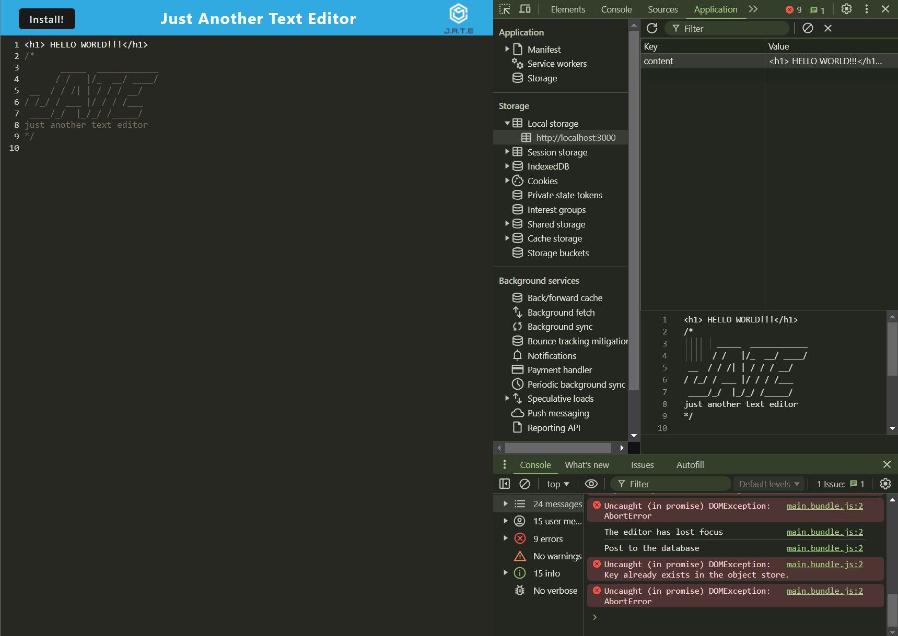
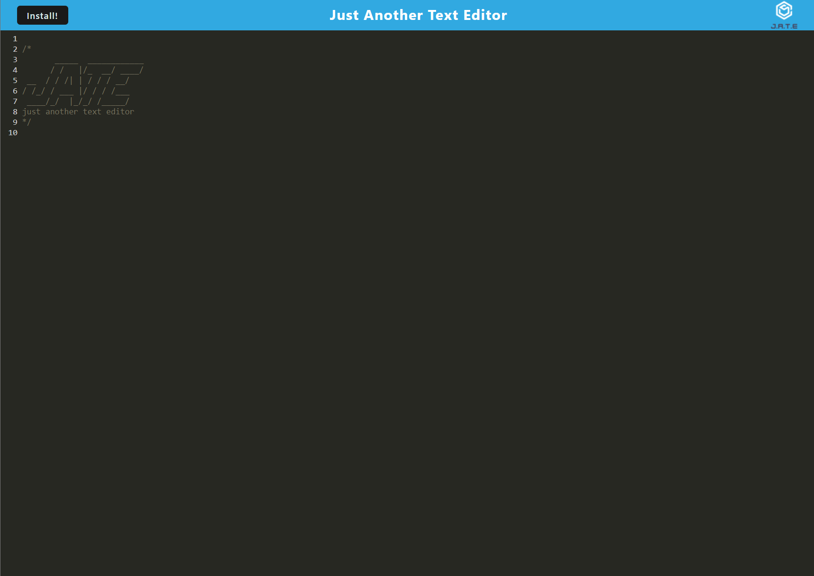

# PWA Text Editor

## Description

This project involves building a Progressive Web Application (PWA) text editor that runs in the browser. The application is a single-page application that meets the PWA criteria and employs various data persistence techniques to ensure redundancy in case one of the options is not supported by the browser. The application is designed to function offline and will be deployed on Render.

The text editor starts with an existing application where methods for getting and storing data in an IndexedDB database are implemented. The `idb` package, a lightweight wrapper around the IndexedDB API used by companies like Google and Mozilla, is utilized for this purpose.

## Table of Contents
- [Description](#description)
- [User Story](#user-story)
- [Acceptance Criteria](#acceptance-criteria)
- [Installation](#installation)
- [Usage](#usage)
- [Deployment](#deployment)
- [Screenshots]()
- [Credits](#credits)
- [License](#license)

## User Story

**As a developer,  
I want to create notes or code snippets with or without an internet connection,  
So that I can reliably retrieve them for later use.**

## Acceptance Criteria

- **Given** a text editor web application
  - **When** I open my application in my editor
    - **Then** I should see a client-server folder structure.
  - **When** I run `npm run start` from the root directory
    - **Then** I find that my application should start up the backend and serve the client.
  - **When** I run the text editor application from my terminal
    - **Then** I find that my JavaScript files have been bundled using webpack.
  - **When** I run my webpack plugins
    - **Then** I find that I have a generated HTML file, service worker, and a manifest file.
  - **When** I use next-gen JavaScript in my application
    - **Then** I find that the text editor still functions in the browser without errors.
  - **When** I open the text editor
    - **Then** I find that IndexedDB has immediately created a database storage.
  - **When** I enter content and subsequently click off of the DOM window
    - **Then** I find that the content in the text editor has been saved with IndexedDB.
  - **When** I reopen the text editor after closing it
    - **Then** I find that the content in the text editor has been retrieved from IndexedDB.
  - **When** I click on the Install button
    - **Then** I download my web application as an icon on my desktop.
  - **When** I load my web application
    - **Then** I should have a registered service worker using Workbox.
  - **When** I register a service worker
    - **Then** I should have my static assets pre-cached upon loading along with subsequent pages and static assets.
  - **When** I deploy to Render
    - **Then** I should have proper build scripts for a webpack application.

## Installation
**Starter Cdoe:** https://github.com/coding-boot-camp/cautious-meme
1. Clone the starter code repository and make your own repository with the starter code:
   ```sh
   git clone [starter-code-repository-url]
   git remote remove origin
   git remote add origin [your-repository-url]
2. Navigate to the project directory:
    ```sh
    cd text-editor
3. Install the dependencies:
    ```sh
    npm install

## Usage
Start the development server:
    ```sh
    npm run start
2. Open your browser and navigate to http://localhost:3000 to use the text editor.

## Deployment
This project is deployed on Render. Follow these steps to deploy your own version:

1. Create a production build:
    ```sh
    npm run build
2. Follow the instructions in the Render Deployment Guide to deploy the build to Render.
    ```sh
    https://coding-boot-camp.github.io/full-stack/render/render-deployment-guide

## Screenshots 
 - Terminal View

 - Home Page

## Credits

Special thanks to my teachers, Drew and Kyle, for their guidance and support in teaching me the right methods to complete this module. Drew's speed runs were particularly helpful.

## License

This project is licensed under the MIT License.